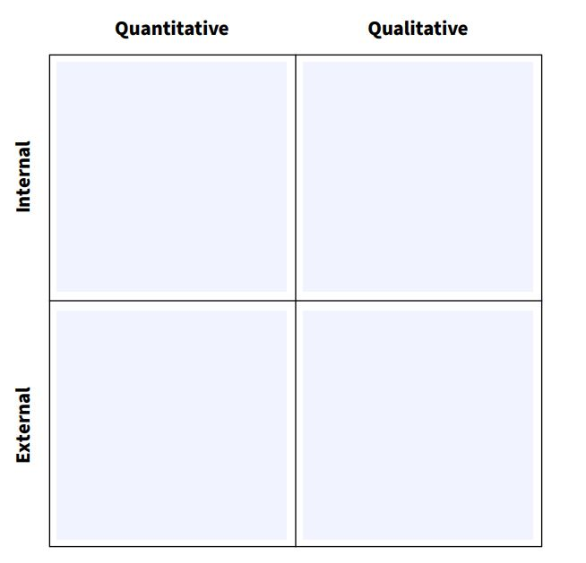
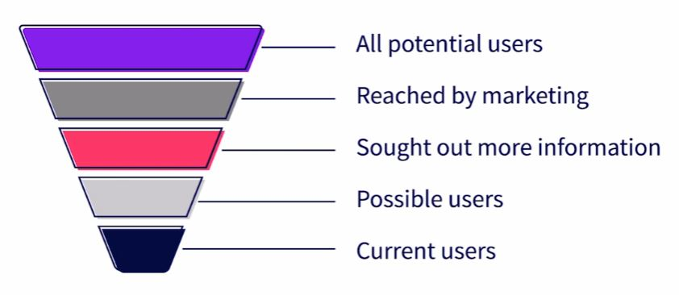

# ProductManagement
## Glossary
Use the terms and definitions below to understand these concepts.

### Go to Market
Who is going to use your product, important part of the release phase in product development.

### Lifecycle
Circular prodecure to plan out a project, not a linear plan witha clear start and end point.

### Plan Phase
Define timeline for a project and translate the research into features to be developed.

### Product
Everything around you, a product does not have to be an object.

### Release
When a product is shown to users; a release can be public or private (Small select group of users).

### Release Phase
Take a product to customers using a marketing plan.

### Research Phase
Research all the aspects of a project.

### Sprint
Tool that provides a picture of how your product development will work.

## Identify Your Core Team
Name all of your core members of your product team from each of these groups.
1. Product Managers
2. Engineering Team
3. Marketing Team
4. User Experience Team

## Identify Your Extended Team
Name all of the extended memebers you will work with from each of these groups. Identify who is the lead or manager that you will work with the most. Include any others that are important for your role as product manager.

1. Research
2. Finance & Audit
3. Public Relations
4. Legal
5. Business Operations
6. Business Development
7. Executives & Investors
8. Other

## Certification Checklist 
Use this checklist to ensure that all of the requirement items have been completed before you release your product. Consult with others related to your product to build the requirements for certification.

### (Additional requirements can be added accordance with your organization)
1. Legal review
2. License review
3. Patent review
4. Security review
5. Code review
6. Vendor review
7. Compliance & audit review
8. ______
9. ______
etc..

## Customer Meeting Summary
Identify all of the core members who will be at every customer meeting and what their role is on the team.

1. Who attended the meeting?
2. What was the best thing from the meeting?
3. What was the worst thing from the meeting?
4. What worked?
5. What didn't work?
6. Additional notes

## Create a Research Plan
Using the four quadrants below, identify what sources you need to create a balanced research plan. Try to find at least two for each area and be specific on where or how you will get the information.

## Customer Meeting Checklist
Use this checklist to build your presentation for your customer meetings. Each section contains elements that you can put into your slide deck or other presentation to drive your conversation and discussion around product features and customer needs.

### Common Statements
What statements or quotes do you want to provide customers to see which they identify with, or disagree with?

### Product Features
What are the names of the features or capabilities you will show in your pitch?

## Feature Categories
Identify the three categories you have for your product, then write or place sticky notes above each category to oragnize features into groups.

## The Product Lifecycle
Identify what activities you will need to do for your project in each phase of the product lifecycle. Consider who you will need to work with, what tools or resources you will need, and what deliverables need to be created at each step.

1. Research
2. Plan
3. Build
4. Release
5. Refine || Retire

## Release
### Define your go-to market
Persona: Are fictional characters used to base the design and direction of a product as the primary targeted user.
Try not to unintentionally build products for ourselves only.

1. Name your persona
2. Give your persona background
3. Persona demographic data (Such as: Gender, Income, Location, etc)
4. Include quotes from your persona
5. Classify personas to Primary users & Secondary users

## Position Your Product To Personas

1. Discover needs
2. Set priorities
3. Define user stories
4. Establish personas
5. Develope communications
6. Create a marketing plan

## Release Your Product
Phased releases are common for web-based products or applications. 
Phased releases give you a way to test and evaluate audience response.

### Types of Releases

1. Soft launch  
&mdash; Finished product is released without any announcement, campaigning or advertisement.

2. Full launch  
&mdash; Release a finished product along with marketing.

3. Modified launch  
&mdash; Early promotions, testing, features before a full release.

## Talk To Your Users & Non-Users
### Talking to Primary Users
&mdash; Does it solve a problem?
&mdash; Do they find value?
&mdash; Will they continue use?

### Talking to Non-Users
&mdash; Do they know the product exists?
&mdash; How did they find out about it?
&mdash; Why don't they use it?

### Churn Themes
&mdash; Poor positioning
&mdash; Price objections
&mdash; Unaware of product

### Not Personas Current Users 
Adding features to support an unknown persona could increase your market.

### Not Personas Non-Users
Non-Users are predicted as expected as they don't find usefulness of your product.

